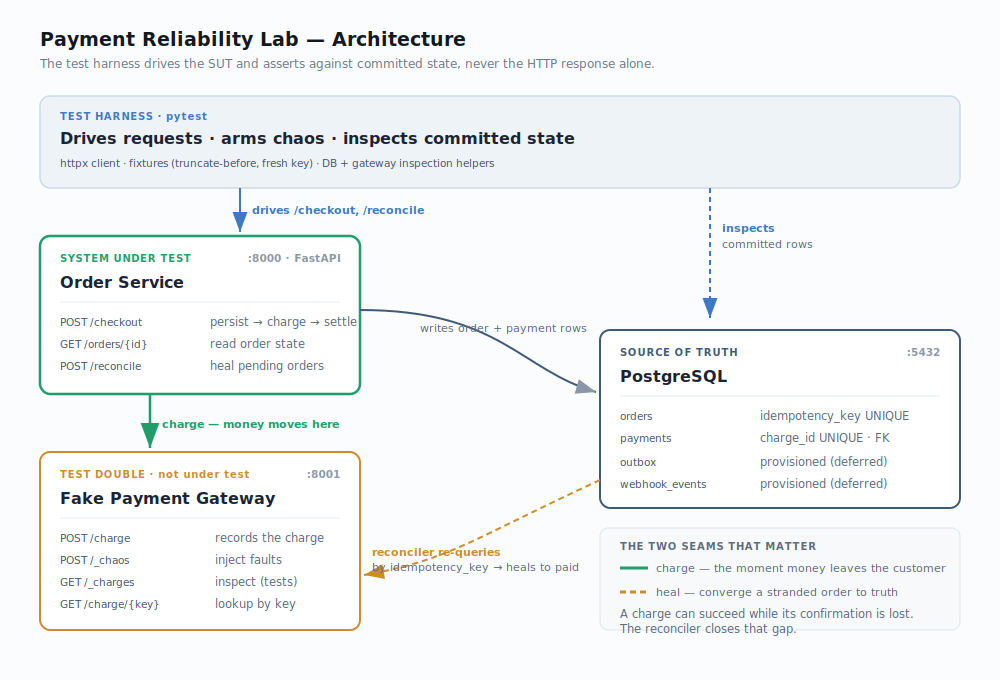

# Payment Reliability Lab

A small, containerized payment system built to **test what happens when a payment half-succeeds** — the customer is charged, but the order never records it. That gap is where real checkout systems break, and this project reproduces it on demand, then proves the system recovers.

The point isn't the application. It's the **test automation around it**, and the discipline of asserting against the money's real location rather than trusting an HTTP `200`.

- **Order Service** — the System Under Test (SUT)
- **Fake Payment Gateway** — a fault-injectable stand-in for a real processor
- **PostgreSQL** — the source of truth for payment state
- **pytest suite** — drives the SUT and asserts at the database layer

---

## Architecture



Three services run together via Docker Compose. The **Order Service** owns the checkout logic and is the only thing under test. The **Fake Gateway** stands in for a real payment processor (Stripe, Adyen, etc.) — it's deliberately controllable, so tests can force it to fail in specific ways. **PostgreSQL** holds the durable ledger that every test asserts against.

Two seams matter, and the diagram highlights both:

- **The charge** (green) — the moment money leaves the customer. It happens *outside* any database transaction, which is exactly why things can go wrong.
- **The heal** (amber) — when a charge succeeds but its confirmation is lost, the order is left stranded. The reconciler re-queries the gateway by `idempotency_key` and converges the order to its true state.

| Service | Port | Role |
|---|---|---|
| Order Service | 8000 | SUT — checkout, order/payment persistence, reconciliation |
| Fake Gateway | 8001 | Test double — charges + fault injection |
| PostgreSQL | 5432 | Source of truth — `orders`, `payments` |

---

## Test scenarios — and the real-world failures they map to

Every test asserts against the **database and the gateway's own record**, never the HTTP status alone. A `200` is what the service *claims*; the rows are what's *true*.

### 1. Idempotency — *"a retry is not a second purchase"*

**Real world:** a customer taps "Pay" twice, or the network retries a slow request. Without protection, they're charged twice — one of the most common and damaging payment bugs.

**What's tested:** the same `idempotency_key` submitted twice (both sequentially and as a simultaneous race) resolves to exactly one order, one payment, one gateway charge. The race is stopped by a `UNIQUE` constraint at the database level — the application's pre-check alone isn't enough under true concurrency.

### 2. Dual-write reconciliation — *"the paid-but-declined problem"* *(flagship)*

**Real world:** the gateway charges the card successfully, but the confirmation never makes it back to the order service — a crash, a deploy, a dropped connection. The money moved; the app shows "failed." The customer's statement disagrees with your system.

**What's tested:** a fault makes the charge succeed but lose the confirmation. The test proves the broken state (charge exists, order stuck `pending`, no payment row), runs the reconciler, then proves recovery (order converges to `paid`, payment recorded, **still only one charge** — healing never re-charges).

### 3. Timeout ambiguity — *"ambiguous is not the same as failed"*

**Real world:** the gateway call times out. Did the charge go through or not? You genuinely don't know — and if you assume "failed," you strand a real charge.

**What's tested:** a fault makes the gateway hang until the client times out. The service returns a deliberate **502** (distinct from the definitive 504 of a reported failure) and leaves the order `pending` rather than marking it failed. The reconciler then determines the truth from the gateway and heals. The lesson is in the contrast: a reported failure and an unknown outcome are different things and must be handled differently.

### Baseline

A happy-path checkout test confirms the full flow works end to end — the trustworthy foundation every failure test builds on.

> A full incident write-up of the flagship scenario — symptom, evidence trail, root cause, recovery, and the catching test — is in [`INCIDENT_PLAYBOOK.md`](./docs/INCIDENT_PLAYBOOK.md).

---

## How the SUT mirrors a real payment service — and how we test it

A real checkout does three things in sequence: record the intent to buy, move the money, then record that the money moved. The hard truth of distributed systems is that **these can't all happen atomically** — the charge lives in an external processor, the order lives in your database, and there's always a gap between them.

This SUT reproduces that exact shape:

1. **Persist the order as `pending`** and commit — *before* charging. This is deliberate: the durable `pending` record, carrying the `idempotency_key`, is the only thing that makes recovery possible later. No pre-persisted order, no way to heal.
2. **Call the gateway to charge** — an external call, outside any database transaction. This is the seam where money can move without the system knowing.
3. **Record the payment and mark the order `paid`** — a second commit, *after* the charge confirms.

The window between steps 1 and 3 is where every interesting failure lives. A real payment system handles this with **idempotency keys**, a **durable ledger**, and a **reconciliation process** that converges state against the processor's truth — and so does this one.

**How the testing works:** the fake gateway exposes a `POST /_chaos` endpoint that arms a specific misbehavior on the next charge (lose the confirmation, or hang until timeout). A test arms a fault, drives a real checkout over HTTP, then inspects the **actual database rows** and the **gateway's own charge record** to prove what really happened. Because the gateway is controllable, the tests can reproduce — deterministically, in seconds — failures that are nearly impossible to trigger on demand against a real processor.

The reconciler runs **synchronously on demand** (triggered by `POST /reconcile`) — a deliberate simplification for a learning project. In production it would be a background worker, and the tests would poll for eventual consistency; the recovery logic is identical either way.

---

## Setup — from zero

### 1. Install Docker

This project runs entirely in containers, so Docker is the only prerequisite.

- **Windows / macOS:** install [Docker Desktop](https://www.docker.com/products/docker-desktop/). On Windows, enable the **WSL 2** backend when prompted (lighter on memory than the Hyper-V backend).
- **Linux:** install [Docker Engine](https://docs.docker.com/engine/install/) and the Compose plugin.

Confirm it's working:

```bash
docker --version
docker compose version
```

### 2. Start the stack

```bash
# From the project root — builds all three services and starts them
docker compose up --build
```

Wait until `docker compose ps` (in another terminal) shows all three services as `healthy` — about 30 seconds on first build.

```bash
docker compose ps
```

### 3. Run the tests

```bash
# Install test dependencies (on your machine, not in the container)
pip install -r requirements-test.txt

# Run the full suite
pytest tests/ -v

# Or a single scenario
pytest tests/integration/test_timeout_ambiguity.py -v
```

> One test (`test_timeout_ambiguous_charge_is_reconciled`) takes ~7–8 seconds — that's the network timeout firing, which *is* the scenario, not a slow test.

### Resetting

```bash
# Stop containers, keep the database
docker compose down

# Stop containers AND wipe the database volume — use this whenever you change the schema
docker compose down -v
```

The database schema is applied automatically on first start. If you edit `infra/schema.sql`, you must `down -v` for the change to take effect.

---

## What's scoped further — and why it matters in the real world

This project deliberately covers three failure classes thoroughly rather than six shallowly. The remaining classes are **designed but deferred** — the schema already provisions for the first two (`outbox`, `webhook_events`).

### Webhooks — async confirmation

**Real world:** most processors confirm charges *asynchronously*, via a webhook fired after the fact. Lost, duplicated, out-of-order, and forged webhooks are a major source of payment bugs. Handling them needs an event model: deduplication on a unique `event_id`, signature verification, and a rule for which event wins when two conflict. This introduces a whole eventing subsystem — a project's worth of testing surface on its own, which is why it's deferred rather than rushed.

### State-machine integrity

**Real world:** an order should never silently move backward — a `paid` order can't revert to `pending`, and a settled order can't be reopened by a late stray event. Enforcing this needs an explicit state machine with illegal transitions rejected at the database or application layer, plus tests that attempt forbidden transitions and assert they're refused.

### Money correctness

**Real world:** the amount charged must exactly equal the amount ordered, in the right currency, with no rounding drift. Amounts here are already stored as integer minor units (no floats), which removes the precision risk — the deferred work is end-to-end tests proving order and payment amounts match across the full round-trip, plus partial-refund and over-refund handling.

### Testing against a real processor

A natural next step is wiring in **Stripe test mode** (free, no real money) as a "real integration" variant — proving the same tests hold against an actual processor's contract, not just the controllable fake. The fake does the teaching; a real-processor pass adds credibility.

---

## Project layout

```
.
├── app/                  # Order Service (the SUT)
├── gateway/              # Fake payment gateway (test double)
├── infra/schema.sql      # Database schema, applied on first start
├── tests/                # pytest suite — integration tests + harness
├── images/               # Architecture diagram
├── docker-compose.yml
└── docs/
    ├── ARCHITECTURE.md       # Detailed code + design walkthrough
    ├── INCIDENT_PLAYBOOK.md  # Flagship incident write-up
    └── SCENARIOS.md          # Failure scenarios in depth
```

For a deeper walkthrough of how the code maps to the architecture and how the test automation connects to the SUT, see [`ARCHITECTURE.md`](./docs/ARCHITECTURE.md) and [`SCENARIOS.md`](./docs/SCENARIOS.md).
